# 📚 Day 1 - Interactive Learning Guide
## Introduction to DevOps & IT Fundamentals

---

## 1. Introduction to DevOps

### What is DevOps?

**DevOps** is a cultural and technical movement that combines **Development** and **Operations** to improve collaboration, automate processes, and deliver software faster and more reliably.

### DevOps Concept Diagram

```mermaid
graph LR
    A[DEVELOPMENT<br/>• Coding<br/>• Testing<br/>• Building] <-->|COLLABORATION| B[OPERATIONS<br/>• Deployment<br/>• Monitoring<br/>• Maintenance]
    C[AUTOMATION<br/>CI/CD Pipeline] --> A
    C --> B
    style A fill:#667eea,stroke:#333,stroke-width:2px,color:#fff
    style B fill:#764ba2,stroke:#333,stroke-width:2px,color:#fff
    style C fill:#43e97b,stroke:#333,stroke-width:2px,color:#fff
```



### DevOps Lifecycle


### Key Principles of DevOps

#### 1. Collaboration
- **Breaking Silos:** Developers and Operations work together
- **Shared Responsibility:** Everyone owns the entire lifecycle
- **Communication:** Regular meetings and feedback loops
- **Tools:** Slack, Jira, Confluence for collaboration

#### 2. Automation
- **CI/CD Pipelines:** Automated build, test, and deployment
- **Infrastructure as Code (IaC):** Automated infrastructure provisioning
- **Configuration Management:** Automated system configuration
- **Benefits:** Reduces errors, saves time, ensures consistency

#### 3. Continuous Integration (CI)
- **Frequent Code Commits:** Developers commit code multiple times daily
- **Automated Testing:** Tests run automatically on each commit
- **Early Bug Detection:** Issues found and fixed quickly
- **Tools:** Jenkins, GitLab CI, GitHub Actions, CircleCI

#### 4. Continuous Deployment (CD)
- **Automated Deployment:** Code automatically deployed to production
- **Faster Releases:** Reduced time from code to production
- **Rollback Capability:** Quick rollback if issues occur
- **Zero-Downtime:** Blue-green or canary deployments

#### 5. Monitoring & Feedback
- **Real-time Monitoring:** Track application and infrastructure health
- **Logging:** Centralized log management
- **Metrics:** Performance and business metrics
- **Feedback Loop:** Data-driven improvements

### DevOps Benefits

```
┌─────────────────────────────────────────────────────────┐
│                    DEVOPS BENEFITS                      │
├─────────────────────────────────────────────────────────┤
│                                                         │
│  ⚡ Faster Time to Market                               │
│     • Reduced deployment time                           │
│     • Quicker feature releases                          │
│                                                         │
│  🔒 Improved Reliability                                │
│     • Fewer failures                                    │
│     • Faster recovery                                   │
│                                                         │
│  💰 Cost Reduction                                      │
│     • Automation reduces manual work                    │
│     • Better resource utilization                       │
│                                                         │
│  👥 Better Collaboration                                │
│     • Breaking down silos                               │
│     • Shared ownership                                  │
│                                                         │
│  📈 Scalability                                         │
│     • Easy to scale up/down                             │
│     • Cloud-native approach                             │
│                                                         │
└─────────────────────────────────────────────────────────┘
```

### DevOps Tools Ecosystem

#### Version Control
- **Git:** Distributed version control
- **GitHub/GitLab/Bitbucket:** Code hosting and collaboration

#### CI/CD Tools
- **Jenkins:** Open-source automation server
- **GitLab CI:** Integrated CI/CD
- **GitHub Actions:** CI/CD in GitHub
- **CircleCI:** Cloud-based CI/CD

#### Configuration Management
- **Ansible:** Agentless automation
- **Chef:** Infrastructure automation
- **Puppet:** Configuration management
- **Terraform:** Infrastructure as Code

#### Containerization
- **Docker:** Container platform
- **Kubernetes:** Container orchestration
- **Docker Compose:** Multi-container applications

#### Monitoring & Logging
- **Prometheus:** Monitoring and alerting
- **Grafana:** Visualization and dashboards
- **ELK Stack:** Elasticsearch, Logstash, Kibana
- **Splunk:** Log analysis platform

#### Cloud Platforms
- **AWS:** Amazon Web Services
- **Azure:** Microsoft Azure
- **GCP:** Google Cloud Platform

### DevOps vs Traditional IT

| Aspect | Traditional IT | DevOps |
|--------|---------------|--------|
| **Release Frequency** | Monthly/Quarterly | Daily/Multiple per day |
| **Deployment Time** | Days/Weeks | Minutes/Hours |
| **Failure Rate** | High | Low |
| **Recovery Time** | Hours/Days | Minutes |
| **Team Structure** | Siloed | Collaborative |
| **Automation** | Manual | Automated |
| **Feedback Loop** | Slow | Fast |
| **Communication** | Limited | Continuous |

### DevOps Culture Shift

#### Before DevOps
```
Developers ──► "It works on my machine!"
                    │
                    ▼
Operations ──► "Why is it broken in production?"
```

#### After DevOps
```
Developers + Operations ──► "Let's build it together!"
                    │
                    ▼
            "We own it together!"
```

---

## 2. How IT Company Works

### IT Company Structure

```mermaid
graph TD
    A[IT COMPANY] --> B[MANAGEMENT<br/>• CEO<br/>• CTO<br/>• Managers]
    A --> C[DEVELOPMENT<br/>• Developers<br/>• QA/Testers<br/>• Architects]
    A --> D[OPERATIONS<br/>• DevOps<br/>• Sys Admins<br/>• SRE]
    B --> E[PRODUCTS<br/>& SERVICES]
    C --> E
    D --> E
    style A fill:#667eea,stroke:#333,stroke-width:3px,color:#fff
    style B fill:#764ba2,stroke:#333,stroke-width:2px,color:#fff
    style C fill:#f093fb,stroke:#333,stroke-width:2px,color:#fff
    style D fill:#4facfe,stroke:#333,stroke-width:2px,color:#fff
    style E fill:#43e97b,stroke:#333,stroke-width:2px,color:#fff
```



### Departments in an IT Company

#### 1. Management
- **CEO (Chief Executive Officer):** Overall company strategy
- **CTO (Chief Technology Officer):** Technology strategy
- **Project Managers:** Project planning and execution
- **Product Managers:** Product vision and roadmap
- **Responsibilities:**
  - Strategic planning
  - Resource allocation
  - Decision making
  - Client relations

#### 2. Development Team
- **Software Developers:** Write code and build features
- **Frontend Developers:** User interface development
- **Backend Developers:** Server-side logic
- **Full-stack Developers:** Both frontend and backend
- **Tech Leads:** Technical guidance and architecture
- **Responsibilities:**
  - Writing code
  - Code reviews
  - Technical design
  - Bug fixes

#### 3. Quality Assurance (QA) / Testing
- **QA Engineers:** Test applications for bugs
- **Test Automation Engineers:** Write automated tests
- **Performance Testers:** Test application performance
- **Responsibilities:**
  - Test planning
  - Manual testing
  - Automated testing
  - Bug reporting

#### 4. DevOps / Operations
- **DevOps Engineers:** Automate deployment and infrastructure
- **System Administrators:** Manage servers and infrastructure
- **Site Reliability Engineers (SRE):** Ensure system reliability
- **Cloud Engineers:** Manage cloud infrastructure
- **Responsibilities:**
  - Infrastructure management
  - CI/CD pipeline setup
  - Monitoring and alerting
  - Incident response

#### 5. Support & Maintenance
- **Technical Support:** Help customers with issues
- **Maintenance Team:** Keep systems running
- **Responsibilities:**
  - Customer support
  - Bug triage
  - System maintenance

### Software Development Lifecycle (SDLC)


### Detailed SDLC Phases

#### 1. Requirement Analysis
- **Stakeholder Meetings:** Understand client needs
- **Documentation:** Create requirement documents
- **Feasibility Study:** Check if project is viable
- **Deliverables:** Requirement Specification Document (RSD)

#### 2. Design
- **System Architecture:** High-level system design
- **Database Design:** Database schema and relationships
- **UI/UX Design:** User interface mockups
- **Deliverables:** Design documents, wireframes

#### 3. Development
- **Coding:** Write code according to design
- **Code Reviews:** Peer review of code
- **Version Control:** Manage code versions (Git)
- **Deliverables:** Working code, unit tests

#### 4. Testing
- **Unit Testing:** Test individual components
- **Integration Testing:** Test component interactions
- **System Testing:** Test entire system
- **User Acceptance Testing (UAT):** Client testing
- **Deliverables:** Test reports, bug reports

#### 5. Deployment
- **Environment Setup:** Dev, Staging, Production
- **Deployment Process:** Deploy code to servers
- **Smoke Testing:** Quick verification after deployment
- **Deliverables:** Deployed application

#### 6. Maintenance
- **Bug Fixes:** Fix issues found in production
- **Updates:** Add new features or improvements
- **Monitoring:** Monitor application health
- **Support:** Provide customer support

### IT Company Workflow

```
Client Request
      │
      ▼
┌──────────────┐
│  Sales Team  │ ──► Understand requirements
└──────┬───────┘
       │
       ▼
┌──────────────┐
│  Management  │ ──► Approve project, allocate resources
└──────┬───────┘
       │
       ▼
┌──────────────┐
│  Development │ ──► Build the application
│    Team      │
└──────┬───────┘
       │
       ▼
┌──────────────┐
│  QA Team     │ ──► Test the application
└──────┬───────┘
       │
       ▼
┌──────────────┐
│  DevOps Team │ ──► Deploy to production
└──────┬───────┘
       │
       ▼
┌──────────────┐
│  Support     │ ──► Maintain and support
└──────────────┘
```

### Roles and Responsibilities Matrix

| Role | Primary Responsibility | Key Skills |
|------|----------------------|------------|
| **Developer** | Write code, build features | Programming, Problem-solving |
| **QA Engineer** | Test applications, find bugs | Testing, Attention to detail |
| **DevOps Engineer** | Automate deployment, manage infrastructure | Automation, Cloud, CI/CD |
| **Project Manager** | Plan and coordinate projects | Communication, Planning |
| **Product Manager** | Define product vision | Market analysis, Strategy |
| **System Admin** | Manage servers and infrastructure | Linux, Networking, Security |
| **Tech Lead** | Technical guidance | Architecture, Leadership |

### Communication Flow

```
┌──────────────┐         ┌──────────────┐         ┌──────────────┐
│  Developers  │◄───────►│  QA Team     │◄───────►│  DevOps      │
│              │         │              │         │              │
│  • Code      │         │  • Test      │         │  • Deploy    │
│  • Features  │         │  • Bugs      │         │  • Monitor   │
└──────┬───────┘         └──────┬───────┘         └──────┬───────┘
       │                       │                         │
       └───────────────────────┼─────────────────────────┘
                               │
                       ┌───────▼───────┐
                       │  Project      │
                       │  Manager      │
                       └───────────────┘
```

### Common IT Company Models

#### 1. Product-Based Company
- **Focus:** Build and sell software products
- **Examples:** Microsoft, Google, Adobe
- **Structure:** Product teams, feature development

#### 2. Service-Based Company
- **Focus:** Provide IT services to clients
- **Examples:** TCS, Infosys, Wipro
- **Structure:** Client projects, consulting

#### 3. Startup
- **Focus:** Rapid growth, innovation
- **Structure:** Small teams, multiple roles
- **Culture:** Fast-paced, agile

#### 4. Enterprise
- **Focus:** Large-scale operations
- **Structure:** Multiple departments, clear hierarchy
- **Culture:** Process-driven, structured

---

## 3. What is an Application?

### Definition

An **Application** (or **App**) is a software program designed to perform specific tasks for end users. Applications run on various platforms like computers, smartphones, tablets, and web browsers.

### Application Types

```mermaid
graph TD
    A[APPLICATION TYPES] --> B[DESKTOP<br/>• Windows<br/>• macOS<br/>• Linux]
    A --> C[MOBILE<br/>• Android<br/>• iOS<br/>• Cross-platform]
    A --> D[WEB<br/>• Browser-based<br/>• No install<br/>• Accessible]
    style A fill:#667eea,stroke:#333,stroke-width:3px,color:#fff
    style B fill:#764ba2,stroke:#333,stroke-width:2px,color:#fff
    style C fill:#f093fb,stroke:#333,stroke-width:2px,color:#fff
    style D fill:#4facfe,stroke:#333,stroke-width:2px,color:#fff
```



### Desktop Applications

#### Characteristics
- **Installation Required:** Must be installed on the computer
- **Platform Specific:** Windows, macOS, or Linux versions
- **Offline Capability:** Can work without internet
- **System Resources:** Uses local CPU, RAM, storage

#### Examples
- **Microsoft Office:** Word, Excel, PowerPoint
- **Adobe Creative Suite:** Photoshop, Illustrator
- **Media Players:** VLC, Windows Media Player
- **Games:** Desktop games, Steam games
- **Development Tools:** VS Code, IntelliJ IDEA

#### Architecture
```
┌─────────────────────────────────┐
│      Desktop Application        │
│                                 │
│  ┌──────────────────────────┐  │
│  │   User Interface (UI)    │  │
│  └───────────┬──────────────┘  │
│              │                  │
│  ┌───────────▼──────────────┐  │
│  │   Business Logic         │  │
│  └───────────┬──────────────┘  │
│              │                  │
│  ┌───────────▼──────────────┐  │
│  │   Data Storage (Local)   │  │
│  └──────────────────────────┘  │
└─────────────────────────────────┘
```

### Mobile Applications

#### Characteristics
- **Platform Specific:** iOS (Apple) or Android (Google)
- **App Stores:** Distributed through App Store or Google Play
- **Touch Interface:** Optimized for touch screens
- **Device Features:** Access to camera, GPS, sensors

#### Types
- **Native Apps:** Built for specific platform (Swift for iOS, Kotlin/Java for Android)
- **Hybrid Apps:** Web technologies wrapped in native container
- **Cross-platform:** React Native, Flutter (one codebase, multiple platforms)

#### Examples
- **Social Media:** Facebook, Instagram, Twitter
- **Communication:** WhatsApp, Telegram, Zoom
- **E-commerce:** Amazon, Flipkart
- **Banking:** Mobile banking apps
- **Games:** Mobile games

#### Architecture
```
┌─────────────────────────────────┐
│      Mobile Application         │
│                                 │
│  ┌──────────────────────────┐  │
│  │   Mobile UI (Touch)       │  │
│  └───────────┬──────────────┘  │
│              │                  │
│  ┌───────────▼──────────────┐  │
│  │   App Logic              │  │
│  └───────────┬──────────────┘  │
│              │                  │
│  ┌───────────▼──────────────┐  │
│  │   Backend API            │  │
│  │   (Cloud Services)       │  │
│  └──────────────────────────┘  │
└─────────────────────────────────┘
```

### Web Applications

#### Characteristics
- **Browser-Based:** Runs in web browsers
- **No Installation:** Access via URL
- **Cross-Platform:** Works on any device with browser
- **Internet Required:** Needs internet connection (mostly)

#### Types
- **Static Web Apps:** Simple HTML, CSS, JavaScript
- **Dynamic Web Apps:** Server-side processing (PHP, Python, Node.js)
- **Single Page Applications (SPA):** React, Angular, Vue.js
- **Progressive Web Apps (PWA):** Web apps that work like native apps

#### Examples
- **E-commerce:** Amazon.com, eBay
- **Social Media:** Facebook.com, LinkedIn
- **Productivity:** Gmail, Google Docs
- **Banking:** Online banking portals
- **Streaming:** Netflix, YouTube

#### Architecture
```
┌─────────────────────────────────┐
│      Web Browser                │
│  ┌──────────────────────────┐  │
│  │   Web Application UI      │  │
│  │   (HTML, CSS, JavaScript)│  │
│  └───────────┬──────────────┘  │
└──────────────┼──────────────────┘
               │ HTTP/HTTPS
               ▼
┌─────────────────────────────────┐
│      Web Server                 │
│  ┌──────────────────────────┐  │
│  │   Application Server     │  │
│  │   (Backend Logic)        │  │
│  └───────────┬──────────────┘  │
│              │                  │
│  ┌───────────▼──────────────┐  │
│  │   Database               │  │
│  └──────────────────────────┘  │
└─────────────────────────────────┘
```

### Application Components

#### 1. Frontend (Client-Side)
- **User Interface:** What users see and interact with
- **Technologies:** HTML, CSS, JavaScript, React, Angular, Vue
- **Responsibilities:**
  - Display data
  - User interactions
  - Form validation
  - API calls to backend

#### 2. Backend (Server-Side)
- **Business Logic:** Core functionality and rules
- **Technologies:** Node.js, Python, Java, PHP, .NET
- **Responsibilities:**
  - Process requests
  - Business logic execution
  - Database operations
  - API endpoints

#### 3. Database
- **Data Storage:** Stores application data
- **Types:** Relational (MySQL, PostgreSQL) or NoSQL (MongoDB)
- **Responsibilities:**
  - Store data
  - Retrieve data
  - Data relationships
  - Data integrity

### Application Architecture Patterns

#### 1. Monolithic Architecture
```
┌─────────────────────────────────┐
│      Single Application         │
│                                 │
│  ┌──────┐  ┌──────┐  ┌──────┐ │
│  │ UI   │  │Logic │  │ DB   │ │
│  └──────┘  └──────┘  └──────┘ │
└─────────────────────────────────┘
```
- **Pros:** Simple, easy to develop
- **Cons:** Hard to scale, single point of failure

#### 2. Client-Server Architecture
```
┌──────────┐         ┌──────────┐
│  Client  │◄───────►│  Server  │
│  (UI)    │         │  (Logic) │
└──────────┘         └────┬─────┘
                          │
                    ┌─────▼─────┐
                    │ Database  │
                    └───────────┘
```
- **Pros:** Separation of concerns, scalable
- **Cons:** Server dependency

#### 3. Microservices Architecture
```
┌──────────┐  ┌──────────┐  ┌──────────┐
│ Service1 │  │ Service2 │  │ Service3 │
│          │  │          │  │          │
└────┬─────┘  └────┬─────┘  └────┬─────┘
     │            │            │
     └────────────┼────────────┘
                  │
            ┌─────▼─────┐
            │  API      │
            │  Gateway  │
            └───────────┘
```
- **Pros:** Scalable, independent deployment
- **Cons:** Complex, network overhead

### Application Development Process

```
┌──────────┐    ┌──────────┐    ┌──────────┐    ┌──────────┐
│  IDEA    │───►│  DESIGN  │───►│  DEVELOP │───►│   TEST   │
└──────────┘    └──────────┘    └──────────┘    └──────────┘
     ▲                                                  │
     │                                                  ▼
┌──────────┐    ┌──────────┐    ┌──────────┐    ┌──────────┐
│ UPDATE   │◄───│ DEPLOY   │◄───│  BUILD   │◄───│  FIX     │
└──────────┘    └──────────┘    └──────────┘    └──────────┘
```

### Application Categories

| Category | Examples | Use Case |
|----------|----------|----------|
| **Productivity** | Office Suite, Email, Calendar | Work and organization |
| **Social Media** | Facebook, Instagram, Twitter | Social networking |
| **E-commerce** | Amazon, Flipkart, eBay | Online shopping |
| **Entertainment** | Netflix, Spotify, Games | Leisure and fun |
| **Communication** | WhatsApp, Zoom, Slack | Messaging and calls |
| **Banking/Finance** | Banking apps, PayPal | Financial transactions |
| **Education** | Learning platforms, E-books | Learning and teaching |
| **Healthcare** | Health trackers, Telemedicine | Health management |

---

## 4. Developers vs Testers vs DevOps

### Role Comparison Overview

```
┌─────────────────────────────────────────────────────────┐
│              SOFTWARE DEVELOPMENT TEAM                   │
└─────────────────────────────────────────────────────────┘
                            │
        ┌───────────────────┼───────────────────┐
        │                   │                   │
        ▼                   ▼                   ▼
┌──────────────┐    ┌──────────────┐    ┌──────────────┐
│ DEVELOPERS   │    │   TESTERS    │    │    DEVOPS    │
│              │    │              │    │              │
│ Write Code   │    │ Test Code    │    │ Deploy Code  │
│ Build Features│   │ Find Bugs    │    │ Manage Infra │
│ Fix Bugs     │    │ Verify Quality│   │ Automate     │
└──────────────┘    └──────────────┘    └──────────────┘
```

### Detailed Role Comparison

| Aspect | Developers | Testers (QA) | DevOps |
|--------|-----------|--------------|--------|
| **Primary Focus** | Writing code | Testing code | Deployment & Infrastructure |
| **Main Goal** | Build features | Find bugs | Automate & deploy |
| **Key Skills** | Programming languages | Testing methodologies | Automation, Cloud, CI/CD |
| **Tools** | IDEs, Git, Frameworks | Testing tools, Bug trackers | CI/CD, IaC, Monitoring |
| **Workflow Stage** | Development phase | Testing phase | Deployment & Operations |
| **Deliverables** | Working code | Test reports, Bug reports | Deployed applications |
| **Interaction** | With code | With applications | With infrastructure |

### Developers

#### Responsibilities
- **Write Code:** Develop features and functionality
- **Code Reviews:** Review peer code for quality
- **Debugging:** Fix bugs and issues
- **Design:** Create technical designs and architecture
- **Documentation:** Write code documentation
- **Testing:** Write unit tests

#### Skills Required
- **Programming Languages:** Java, Python, JavaScript, C++, etc.
- **Frameworks:** React, Angular, Spring, Django, etc.
- **Databases:** SQL, NoSQL databases
- **Version Control:** Git, GitHub, GitLab
- **Problem Solving:** Algorithm design, debugging

#### Daily Tasks
```
┌─────────────────────────────────┐
│   DEVELOPER DAILY WORKFLOW      │
├─────────────────────────────────┤
│                                 │
│  1. Stand-up meeting            │
│  2. Review requirements         │
│  3. Write code                  │
│  4. Write unit tests            │
│  5. Code review                 │
│  6. Fix bugs                    │
│  7. Commit code to Git          │
│  8. Deploy to dev environment    │
│                                 │
└─────────────────────────────────┘
```

#### Developer Types
- **Frontend Developer:** UI/UX implementation
- **Backend Developer:** Server-side logic
- **Full-stack Developer:** Both frontend and backend
- **Mobile Developer:** iOS/Android apps
- **DevOps Developer:** Infrastructure code

### Testers (QA Engineers)

#### Responsibilities
- **Test Planning:** Create test plans and strategies
- **Manual Testing:** Execute test cases manually
- **Automated Testing:** Write and maintain test scripts
- **Bug Reporting:** Document and report bugs
- **Test Execution:** Run various types of tests
- **Quality Assurance:** Ensure product quality

#### Skills Required
- **Testing Methodologies:** Manual, Automation, Performance
- **Testing Tools:** Selenium, JUnit, TestNG, Postman
- **Bug Tracking:** Jira, Bugzilla
- **Test Automation:** Selenium, Cypress, Appium
- **Attention to Detail:** Find edge cases and bugs

#### Daily Tasks
```
┌─────────────────────────────────┐
│   TESTER DAILY WORKFLOW         │
├─────────────────────────────────┤
│                                 │
│  1. Review new features         │
│  2. Create test cases            │
│  3. Execute manual tests         │
│  4. Run automated tests          │
│  5. Report bugs                  │
│  6. Verify bug fixes             │
│  7. Regression testing           │
│  8. Test documentation           │
│                                 │
└─────────────────────────────────┘
```

#### Tester Types
- **Manual Tester:** Manual test execution
- **Automation Tester:** Automated test scripts
- **Performance Tester:** Load and stress testing
- **Security Tester:** Security vulnerability testing
- **API Tester:** API testing and validation

### DevOps Engineers

#### Responsibilities
- **CI/CD Pipeline:** Set up and maintain CI/CD pipelines
- **Infrastructure Management:** Manage cloud infrastructure
- **Automation:** Automate deployment and operations
- **Monitoring:** Set up monitoring and alerting
- **Incident Response:** Handle production incidents
- **Infrastructure as Code:** Write IaC scripts

#### Skills Required
- **CI/CD Tools:** Jenkins, GitLab CI, GitHub Actions
- **Cloud Platforms:** AWS, Azure, GCP
- **Containerization:** Docker, Kubernetes
- **IaC:** Terraform, CloudFormation
- **Scripting:** Bash, Python, PowerShell
- **Monitoring:** Prometheus, Grafana, ELK

#### Daily Tasks
```
┌─────────────────────────────────┐
│   DEVOPS DAILY WORKFLOW         │
├─────────────────────────────────┤
│                                 │
│  1. Monitor system health       │
│  2. Review deployment pipeline  │
│  3. Automate tasks              │
│  4. Manage infrastructure       │
│  5. Handle incidents             │
│  6. Update documentation        │
│  7. Optimize performance        │
│  8. Security updates            │
│                                 │
└─────────────────────────────────┘
```

#### DevOps Focus Areas
- **Infrastructure:** Servers, networks, cloud resources
- **Automation:** Deployment, testing, configuration
- **Monitoring:** Application and infrastructure monitoring
- **Security:** Security scanning, compliance
- **Scalability:** Auto-scaling, load balancing

### Collaboration Flow

```
┌──────────────┐
│  Developer   │
│  Writes Code │
└──────┬───────┘
       │
       ▼
┌──────────────┐
│  Git Commit  │
│  Push Code   │
└──────┬───────┘
       │
       ▼
┌──────────────┐         ┌──────────────┐
│  CI Pipeline │────────►│   Tester     │
│  (DevOps)    │         │  Tests Code  │
└──────┬───────┘         └──────┬───────┘
       │                       │
       │                       ▼
       │              ┌──────────────┐
       │              │  Bug Found?  │
       │              └──────┬───────┘
       │                     │
       │         ┌───────────┴───────────┐
       │         │                       │
       │         ▼                       ▼
       │    ┌─────────┐            ┌─────────┐
       │    │ Fix Bug │            │  Pass   │
       │    │(Dev)    │            │         │
       │    └────┬────┘            └────┬────┘
       │         │                       │
       │         └───────────┬───────────┘
       │                     │
       ▼                     ▼
┌──────────────┐
│  DevOps     │
│  Deploys    │
│  to Prod    │
└──────────────┘
```

### Key Differences Summary

#### Developers
- **Focus:** Building features
- **Mindset:** "How can I build this?"
- **Success Metric:** Features delivered, code quality
- **Timeline:** Sprint-based development

#### Testers
- **Focus:** Finding issues
- **Mindset:** "How can I break this?"
- **Success Metric:** Bugs found, test coverage
- **Timeline:** Testing phase, continuous testing

#### DevOps
- **Focus:** Automation and deployment
- **Mindset:** "How can I automate this?"
- **Success Metric:** Deployment frequency, uptime
- **Timeline:** Continuous deployment

### Working Together

#### Successful Collaboration
```
┌─────────────────────────────────────────┐
│      EFFECTIVE TEAM COLLABORATION       │
├─────────────────────────────────────────┤
│                                         │
│  Developers ──► Write clean, testable  │
│                 code                    │
│                                         │
│  Testers ──► Provide early feedback,   │
│             clear bug reports           │
│                                         │
│  DevOps ──► Enable fast, reliable        │
│            deployments                  │
│                                         │
│  All ──► Communicate, share knowledge,  │
│          work towards common goal       │
│                                         │
└─────────────────────────────────────────┘
```

#### Common Challenges
- **Silos:** Teams working in isolation
- **Blame Game:** Pointing fingers when issues occur
- **Communication Gap:** Lack of clear communication
- **Different Priorities:** Conflicting goals

#### Solutions (DevOps Culture)
- **Shared Ownership:** Everyone owns the product
- **Open Communication:** Regular stand-ups, retrospectives
- **Collaboration Tools:** Slack, Jira, Confluence
- **Cross-training:** Understanding each other's roles

### Career Paths

#### Developer Career Path
```
Junior Developer
      │
      ▼
Senior Developer
      │
      ▼
Tech Lead / Architect
```

#### Tester Career Path
```
Junior QA Engineer
      │
      ▼
Senior QA Engineer
      │
      ▼
QA Lead / Test Architect
```

#### DevOps Career Path
```
Junior DevOps Engineer
      │
      ▼
Senior DevOps Engineer
      │
      ▼
DevOps Lead / SRE
```

### Salary Comparison (General Range)

| Role | Entry Level | Mid-Level | Senior Level |
|------|------------|-----------|--------------|
| **Developer** | $50k-70k | $80k-120k | $130k-180k+ |
| **Tester** | $45k-65k | $70k-100k | $110k-150k+ |
| **DevOps** | $60k-80k | $100k-140k | $150k-200k+ |

*Note: Salaries vary by location, company, and experience*

---

## Summary

This guide covered 4 essential topics for Day 1:

1. **Introduction to DevOps** - Understanding DevOps culture, principles, tools, and benefits
2. **How IT Company Works** - Company structure, departments, SDLC, and workflows
3. **What is an Application?** - Types of applications, architecture, and development process
4. **Developers vs Testers vs DevOps** - Role comparison, responsibilities, and collaboration

### Key Takeaways

- **DevOps** bridges development and operations through automation and collaboration
- **IT Companies** have structured departments working together in SDLC
- **Applications** come in various forms (desktop, mobile, web) with different architectures
- **Team Roles** (Developers, Testers, DevOps) have distinct responsibilities but must collaborate

### Next Steps

1. **Practice DevOps Tools:** Set up CI/CD pipelines, learn Docker
2. **Understand SDLC:** Study different methodologies (Agile, Waterfall)
3. **Build Applications:** Start with simple projects
4. **Learn Collaboration:** Practice Git, code reviews, team communication

---

**Happy Learning! 🚀**
